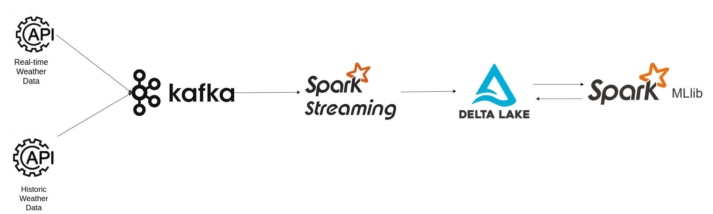

# time-series-forecasting-spark-kafka-for-weather-data
## Overview

This project streams real-time weather data using WeatherAPI, processes it with Apache Kafka and PySpark, and performs time series forecasting using a Deep LSTM model. It stores the processed data in Delta Lake and utilizes historical weather data from an API since 2010 for forecasting future trends using the SARIMAX model.



## Setup Instructions

### Prerequisites

- [Apache Spark](https://spark.apache.org/) installed on your system.
- Docker installed to run necessary containers.
- WeatherAPI key for streaming current weather data.
- Historical weather API access for data since 2010.

### Installation Steps

1. Clone the project repository:
   ```bash
   https://github.com/YasmineHabchi/time-series-forecasting-spark-kafka-for-weather-data.git
   ```

2. Navigate to the project directory:
   ```bash
      cd Kafka_Spark_Stream_data-analysis
   ```
3. Run Docker Compose to set up necessary containers:
```bash
      docker-compose up -d
   ```
4. Run Kafka producer to stream data:
   ```bash
      spark-submit --master local --driver-memory 4g --num-executors 2 --executor-memory 4g --packages org.apache.spark:spark-sql-kafka-0-10_2.12:3.5.0,io.delta:delta-spark_2.12:3.0.0 spark/kafka_consumer.py
   ```
5.Execute Jupyter notebooks for machine learning models training.

### Project Structure
- **kafka_producer.py**: Python script to stream weather data to Kafka topic.
- **kafka_consumer.py**: PySpark script for consuming and processing data from Kafka topic.
- **TimeSeries-Forecasting-Dynamic-Non_Dynamic.ipynb**:
     This Jupyter notebook covers the following steps for time-series forecasting:

  - **Handling Seasonality**:
    - The notebook addresses seasonality using decomposition techniques or seasonal adjustments.
    - Long-term trends are captured using **Moving Averages** to smooth short-term fluctuations.

  - **Model Parameter Optimization**:
    - **Grid Search** is used to find the optimal parameters for the model, ensuring better performance.

  - **Weather Forecasting with SARIMAX**:
    - The **SARIMAX model** is implemented to handle seasonal patterns and external factors affecting weather forecasting.

  - **Dynamic vs Non-Dynamic Forecast Comparison**:
    - The notebook compares **dynamic** and **non-dynamic forecasts** to assess their performance and real-world applicability.

  - **Model Performance Evaluation**:
    - The notebook evaluates the model using diagnostic plots (e.g., residuals) and key metrics such as **AIC** (Akaike Information Criterion) and **RMSE** (Root Mean Squared Error) to ensure accuracy and reliability.
- **Weather_data**: Weather data from the website http://rp5.ru/. The data are average daily temperatures collected by the weather station 2978 in Helsinki from January 2015 to September 2019.


- **docker-compose.yml**: Docker Compose file for setting up necessary containers.
- **Notebooks**: Jupyter notebooks for training machine learning models.
   - **Deep LSTM model.ipynb**: Jupyter notebook for training the Deep LSTM model for time series forecasting.
   - **weather-forecasting.ipynb**: Jupyter notebook for training the DecisionTreeRegressor model.
   - **Temperature_Forecasting_ARIMA**: Jupyter notebook for predicting hourly and daily temperature of Berlin with applying ARIMA model.
